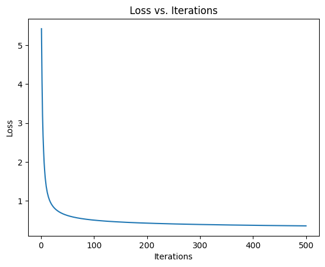
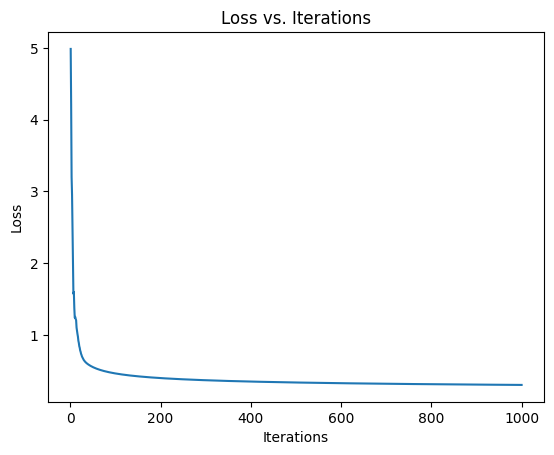

# <center>**机器学习及应用实验报告**</center>

## <center>**Exercise1-Softmax Regression**</center>

## <center> **网络空间安全学院 信息安全专业**</center>

## <center> **2112492 刘修铭**</center>

https://github.com/lxmliu2002/Machine_Learning_and_Its_Applications

# 一、实验要求

* 实现 `softmax` 目标函数，计算损失值 $J(\theta ,x,y)$，将它储存在变量 $f$ 中，并计算梯度 $\nabla_{\theta} J(\theta,x,y)$，将它储存在变量 $g$ 中。

* 实现 $cal\_accuracy()$，输出分类器在测试集上的准确率。
* 使用调试策略进行梯度检查。
* 调整超参数，尽可能得到较高的分类准确率。


# 二、问题分析

本次实验需要完成对 MNIST 数据集中手写数字的分类任务。为了达到更好的分类准确率，需要设置合适的超参；为了确保正确的梯度，需要进行梯度检查；为了提高代码的计算速度，需要优化相关算法。

1. 超参设置
在 softmax_regression.py 文件中，需要设置一些超参，例如学习率、迭代次数、正则化参数等。为了获得更高的分类准确率，需要通过实验来确定最佳的超参设置。

2. 梯度检查
在实现 softmax 目标函数和计算梯度时，需要确保梯度计算的正确性，因而需要进行梯度检查。

3. 优化方法
在使用 for 循环实现梯度计算时，代码的计算速度会很慢。为了提高代码的计算速度，可以使用一些优化方法，从而加快实验的进程。


# 三、实验原理、过程及代码分析

## （一）数据加载及预处理

给定的MNIST数据集是由 0〜9 手写数字图片和数字标签所组成的，包括 60000 个训练样本和 10000 个测试样本，每个样本都是一张 $28\times28$ 像素的灰度手写数字图片。

- **数据加载**：数据加载过程包括从数据文件中读取图像和标签数据。使用了自定义的 `load_mnist` 函数来完成数据的二进制读取和解析。训练集包含图像和相应的标签，测试集也包含类似的数据。
- **数据预处理**：在 Softmax 回归模型中，数据预处理非常重要。本次实验中进行了以下数据预处理步骤：
  - **图像二值化**：将灰度图像二值化，将像素值小于等于 40 的设为 0，大于 40 的设为 1。这有助于简化图像特征，使其更适合 Softmax 回归模型的处理。
  - **标签转换**：将标签进行独热编码，其中每个样本的真实标签由一个包含 10 个元素的向量表示，其中只有一个元素为 1，表示样本所属的类别。

## （二）Softmax回归模型

Softmax 回归是一种用于多类别分类的机器学习模型，通常用于将输入数据分为多个不同的类别。在本实验中，使用 Softmax 回归模型来处理MNIST数据集，将手写数字图像分为 10 个不同的数字类别（0 到 9）。其基本原理如下：

- **输入数据**：输入数据是图像，每个图像由像素组成。这些像素构成了特征向量，表示了图像的特征。
- **参数矩阵 `theta`**：Softmax 回归模型使用一个参数矩阵 `theta`，其中每一行对应一个类别，每一列对应一个特征。在的实验中， `theta` 的形状是 (k, n)，其中 `k` 表示类别数量， `n` 表示特征数量。每一行 `theta[i]` 包含了对应类别 `i` 的分类器的权重。
- **预测过程**：给定输入特征向量 `x`，Softmax 回归模型计算每个类别的得分，得分用向量 `score` 表示。然后，通过 Softmax 函数将这些得分转化为类别概率分布。Softmax 函数的计算公式为 $softmax(z)_i=\dfrac{e^{z_{i}}}{\Sigma^{k}_{j=1}e^{z_{j}}}$。其中 $k$ 表示类别数量。
- **损失函数**：本次实验使用交叉熵损失函数来衡量模型的预测与实际标签之间的差异。损失函数的计算公式为 $Loss = -\dfrac{1}{m}\Sigma^{m}_{i=1}\Sigma^k_{j=1}y_{ij}\log(softmax(z)_j)$。其中，$m$ 表示训练样本数量， $k$ 表示类别数量， $y_{ij}$ 是一个二元指示函数，当类别 $j$ 是样本 $i$ 的真实类别时为 1，否则为 0。
  - 为了训练分类器，需要计算损失函数的梯度。具体来说，需要计算关于模型参数 $\theta$ 的偏导数 $\frac{\partial J}{\partial \theta}$。根据链式法则，可以将 $\frac{\partial J}{\partial \theta}$ 表示为 $\frac{\partial J}{\partial \hat{y}} \frac{\partial \hat{y}}{\partial z} \frac{\partial z}{\partial \theta}$ 的形式，其中 $\hat{y}$ 表示 Softmax 函数的输出，z 表示 Softmax 函数的输入。根据这个公式，可以分别计算 $\frac{\partial J}{\partial \hat{y}}$、$\frac{\partial \hat{y}}{\partial z}$ 和 $\frac{\partial z}{\partial \theta}$ 的值，从而得到 $\frac{\partial J}{\partial \theta}$ 的值。

- **训练过程**：Softmax回归通过梯度下降算法来最小化损失函数，以学习参数 `theta`。在每个训练迭代中，计算梯度并更新参数，以使损失函数逐渐减小。梯度的计算公式为 $Gradient=\dfrac{1}{m}\Sigma^{m}_{i=1}(sfotmax(z)_i-y_i)\times x_i$，更新梯度的公式为 $\theta_{new} = \theta_{old}-\alpha\times Gradient$。

在的实验中，将 `k` 设置为 10（10 个不同的数字类别），`theta` 是一个形状为 (10, n) 的参数矩阵，`iters` 控制了训练的迭代次数，`alpha` 是学习率，控制了参数更新的步长。

上述内容的具体代码实现如下：

```python
# x:train y:lable
def softmax_regression(theta, x, y, iters, alpha):
    # TODO: Do the softmax regression by computing the gradient and
    # the objective function value of every iteration and update the theta
    
    # print("theta.shape",theta.shape) (10, 784)       theta[10, 784]
    # print("y.shape",y.shape) (10, 60000)             y[10, 60000]
    # print("x.shape",x.shape) (60000, 784)            x[60000, 784]
    m = x.shape[0]
    # print(m) m = 60000                               m = 60000
    loss_history = []
    for i in range(iters):
    # for i in tqdm(range(iters), desc="Training"):
        scores = np.dot(theta, x.T)  # Calculate scores for each class
        # print(scores.shape) (10, 60000)
        exp_scores = np.exp(scores - np.max(scores, axis = 0))  # Subtract max score for numerical stability
        # print(exp_scores.shape) (10, 60000)
        probabilities = exp_scores / np.sum(exp_scores, axis = 0)  # Calculate class probabilities
        # print("probabilities",probabilities.shape) (10, 60000)
        
        # probabilities = np.exp(np.matmul(theta, x.T)) / np.sum(np.exp(np.matmul(theta, x.T)), axis=0)
        f = -np.sum(y * np.log(probabilities)) / m
        loss_history.append(f)
        # Calculate the gradient
        g = np.dot((probabilities - y), x) / m
        # Update theta using gradient descent
        theta -= alpha * g
        
        if (i + 1) % 10 == 0:
            print(f"Iteration {i + 1}/{iters}, f: {f}")


    plt.plot(range(1, iters + 1), loss_history)
    plt.xlabel('Iterations')
    plt.ylabel('Loss')
    plt.title('Loss vs. Iterations')
    plt.show()

    return theta
```

## （三）模型预测与评估

最后，进行数据的分类预测。

- **预测过程**：使用训练好的Softmax回归模型，对测试集中的图像进行预测。通过将测试图像的特征与参数矩阵 `theta` 相乘，可以得到一个得分向量，表示该图像属于每个类别的得分，择具有最高得分的类别作为图像的预测类别。

- **准确率计算**：将预测的结果与测试集中的实际标签进行比较，计算公式为 $Accuracy = \dfrac{Number \enspace of \enspace correct \enspace predictions}{Total \enspace number \enspace of \enspace test \enspace samples}\times 100\%$。代码实现如下：

  ```python
  def cal_accuracy(y_pred, y):
      # TODO: Compute the accuracy among the test set and store it in acc
      # check lenth
      if len(y_pred) != len(y):
          raise ValueError("The lengths of the predicted values and the actual labels are not consistent")
  
      correct = 0
      total = len(y)
  
      for i in range(total):
          if y_pred[i] == y[i]:
              correct += 1
  
      accuracy = (correct / total) * 100.0
  
      return accuracy
  ```


# 四、结果分析

按照给定超参数，即 $iters=500, \enspace alpha = 0.5$ 进行训练，得到 $Loss: 0.3519383496661489\enspace accuracy: 90.71000000000001\% $ ，其损失率随训练轮数的变化图如下：



调整超参数，使得 $iters=500, \enspace alpha = 0.7$ 进行训练，得到 $Loss: 0.3349921700452393\enspace accuracy: 90.94\% $ ，其损失率随训练轮数的变化图如下：


调整超参数，使得 $iters=1000, \enspace alpha = 0.5$ 进行训练，得到 $Loss: 0.3141930862251119\enspace accuracy: 91.16\% $ ，其损失率随训练轮数的变化图如下：


调整超参数，使得 $iters=1000, \enspace alpha = 0.7$ 进行训练，得到 $Loss: 0.3011384805080573\enspace accuracy: 91.49000000000001\% $ ，其损失率随训练轮数的变化图如下：



基于上面结果可知，实现了较好的分类效果，且在一定范围内，准确率与迭代轮数及学习率成正相关。

* **迭代次数 `iters` 的影响**

  - **增加迭代次数**：更多的迭代次数允许模型更好地适应训练数据，提高了训练精度。

  - **过多迭代次数**：如果迭代次数过多，模型可能会过拟合训练数据，导致在测试数据上表现不佳。因此需要进行交叉验证来确定适当的迭代次数，以避免过拟合。

* **学习率 `alpha` 的影响**

  - **合适的学习率**：适当的学习率是一种平衡，可以在较短的时间内使损失函数下降，并在全局最小值处收敛，从而加速模型的收敛速度，使模型在较少的迭代中取得良好的训练效果。

  - **过大的学习率**：如果学习率设置得过高，可能会导致模型在训练过程中发散，损失函数不断增加，最终导致训练失败。

  - **过小的学习率**：如果学习率设置得过小，模型的收敛速度将变得非常慢，需要更多的迭代才能达到满意的性能，或者在某个局部最小值处陷入“死胡同”。