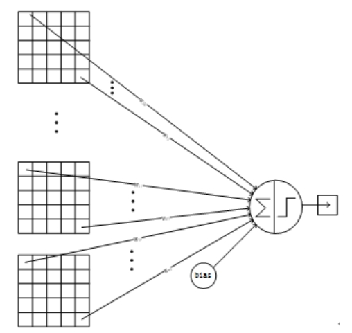
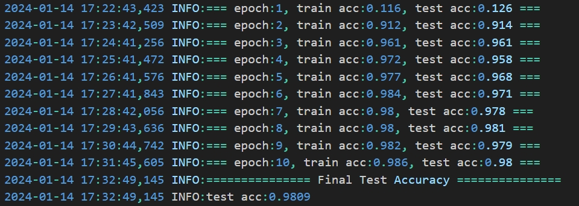
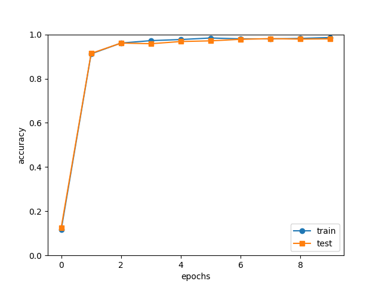
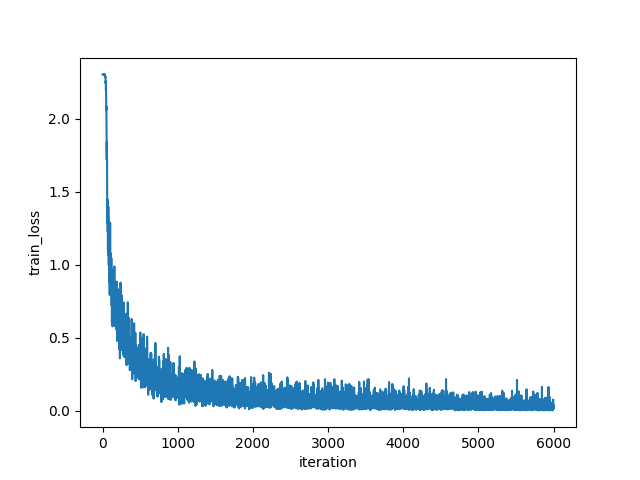

# <center>**机器学习及应用实验报告**</center>

## <center>**Exercise2 - LeNet - 5**</center>

## <center> **网络空间安全学院 信息安全专业**</center>

## <center> **2112492 刘修铭**</center>

# 一、实验要求

* 使用 Python 实现 LeNet - 5 来完成对 MNIST 数据集中 0 - 9 共 10 个手写数字的分类。
  * 代码只能使用 Python 实现，其中数据读取可使用 PIL、opencv - python 等库，矩阵运算可使用 numpy 等计算库，网络前向传播和梯度反向传播需要手动实现，不能使用 PyTorch、TensorFlow、Jax 或 Caffe 等自动微分框架。


# 二、实验环境

* Windows11

* Visual Studio Code v1.85.1

* Python 3.11.4

  > pip install -r requirements.txt

* 11th Gen Intel(R) Core(TM) i7 - 11800H @ 2.30GHz


# 三、问题分析

本次实验，需要对 LeNet - 5 模型进行分析，吃透其中的内在逻辑，在不使用自动微分框架的情况下手动编程进行实现。

本次实验主要包括以下几个部分：

1. **数据准备：**首先进行数据集的下载、读取与预处理，将其转换成可处理的格式，并对其进行划分，使之可用于模型训练与评估。
2. **模型实现：**接着按照 LeNet - 5 模型的架构进行程序编写，实现 LeNet - 5 模型的搭建。在此基础上实现前向传播、反向传播算法，借助损失函数更新模型的权重，对模型进行优化。
3. **模型训练：** 按照前面的数据集划分，使用训练集来训练模型，通过反向传播不断更新模型参数，直至达到一定的训练轮次或模型收敛。
4. **模型评估与分析：**使用测试集对训练好的模型进行评估，计算准确率等指标来评估模型的性能，并针对其性能进行分析。


# 四、实验原理

## （一）LeNet - 5 网络结构


上图是论文 Gradient-Based Learning Applied to Document Recognition 中首次提出的 LeNet - 5 模型架构，是第一个成功应用于数字识别问题的卷积神经网络。

输入的二维图像（单通道），先经过两次卷积层到池化层，再经过全连接层，最后为输出层。整体上是：input layer -> convulational layer -> pooling layer -> activation function -> convulational layer -> pooling layer -> activation function -> convulational layer -> fully connect layer -> fully connect layer -> output layer.

整个 LeNet - 5 网络总共包括 7 层（不含输入层），分别是：C1、S2、C3、S4、C5、F6、OUTPUT。

### 1. INPUT 层 - 输入层

首先是数据 INPUT 层，输入图像的尺寸统一归一化为 $32 \times 32$，通道数为 1。

### 2. C1 层 - 卷积层

该层使用 6 种 $5\times5$ 大小的卷积核，对输入的 $32\times32$ 的图片进行卷积，padding = 0，stride = 1，输出 6 个特征图，featuremap 大小为 $28\times28 :(32-5+1)=28$。在本层中，共有 $(5\times5+1) \times 6 = 156$ （每个滤波器 $5\times5=25$ 个 unit 参数和一个 bias 参数，一共 6 个滤波器）个参数，$28\times28\times6 = 4704$ 个神经元，连接数为 122304。


### 3. S2 层 - 池化层

该层使用 6 个 $2 \ × \ 2$ 大小的卷积核，对输入的 $28\times28$ 的图片进行化，padding  = 0，stride = 2，得到 6 个特征图，featureMap 大小为 $14\times14:(28/2) = 14$。本层先对 C1 中的 $2\times2$ 的感受野内像素加权求和再加上偏置，然后将该结果使用 sigmoid 进行映射，即 $sigmoid(w\sum_{i=1}^4x_i+b)$。在本层中共有 $(1+1)\times6=12$ （第一个 1 为池化对应的 $2 \ × \ 2$ 感受野中最大的那个数的权重 $w$，第二个 1 为偏置 $b$）个参数，$14\times14\times6=1176$ 个神经元，连接数为 5880。


### 4. C3 层 - 卷积层

该层使用 16 种 $5\times5$ 大小的卷积核，对输入图片进行卷积，padding = 0，stride = 1，输出 16 个特征图，featuremap 大小为 $10\times10 :14-5+1=10$。C3 中的每个特征 map 是连接到 S2 中的所有 6 个或者几个特征 map 的，表示本层的特征 map 是上一层提取到的特征 map 的不同组合。


在本层中共有 1516 个参数，连接数为 151600。


### 5. S4 层 - 池化层

该层使用 16 个 $2 \ × \ 2$ 大小的卷积核，对输入的 $28\times28$ 的图片进行化，padding  = 0，stride = 2，得到 16 个特征图，featureMap 大小为 $5\times5:(10/2) = 5$。本层先对 C2 中的 $2\times2$ 的感受野内像素加权求和再加上偏置，然后将该结果使用 sigmoid 进行映射，即 $sigmoid(w\sum_{i=1}^4x_i+b)$。在本层中共有 $(1+1)\times16=32$ 个参数，连接数为 2000。


### 6. F5 层 - 全连接层

该层与 S4 层进行全连接，计算输入向量与权重向量的点积，再加上一个偏置。输入 $16\times5\times5$，输出 featureMap 大小为 $120$。



### 7. F6 层 - 全连接层

该层与 F5 层全连接，每个神经元与其 120 个特征图相连，计算输入向量（120 维向量）和权重向量之间的点积，再加上一个偏置，结果通过 sigmoid 函数输出（84 维向量）。


F6 层有 84 个节点，对应于一个 7x12 的比特图，-1 表示白色，1 表示黑色，这样每个符号的比特图的黑白色就对应于一个编码。ASCII 编码图如下：


### 8. Output 层 - 全连接层

最后的 Output 层也是全连接层，是 Gaussian Connections，共有 10 个节点，分别代表数字 0 到 9，且如果节点 i 的值为 0，则网络识别的结果是数字 i。采用的是径向基函数（RBF）的网络连接方式。假设 x 是上一层的输入，y 是 RBF 的输出，则 RBF 输出的计算方式为 $y_i=\sum_{j=0}^{83}(x_j-w_{ij})^2$。其中 $w_{ij}$ 的值由 i 的比特图编码确定，i 从 0 到 9，j 取值从 0 到$7\times12-1$。RBF 输出的值越接近于 0，则越接近于 i，即越接近于 i 的 ASCII 编码图，表示当前网络输入的识别结果是字符 i。

## （二）实现改动

本次实验基于 Gradient-Based Learning Applied to Document Recognition 论文进行编写。经过多次尝试，综合考虑模型性能等因素，对论文中的实现做出如下改动：

1. 论文中，作者使用 Sigmoid 函数作为激活函数，但考虑到 Sigmoid 函数的导数在输入接近 0 或者远离 0 的时候，都会趋于 0。在深度网络中，这可能导致梯度消失问题，即在反向传播过程中，梯度逐渐变得非常小，使得权重更新变得非常缓慢。而 ReLU 的导数在正数部分为 1，因此更不容易引起梯度消失的问题。故而本次实验中，改用 ReLU 激活函数。代码中，两种激活函数均予以给出。
2. 论文中，作者在池化层部分使用加权池化方式进行计算，但考虑到最大池化在保留重要信息、减少参数数量、提高计算效率等方面都表现出良好的性能，故而本次实验使用最大池化。
3. 论文中，作者在 C3 卷积层部分使用映射连接，考虑到全连接能够有助于捕捉更高级别的特征和全局关联，本次实验仍然采取全部连接。
4. 本次实验中，采用交叉熵损失函数。


# 五、实验过程及代码分析

## （一）数据加载及预处理

本次实验参考 Ex1，完成对 mnist 数据集的加载。

此部分代码详见 `dataloader.py` 文件。

## （二）网络搭建

### LeNet5

本次实验中，定义了一个 `LeNet5` 类表示一个 LeNet - 5 架构，其中定义了多个类内方法：

* **`__init__` 方法：**

   * 该方法完成了对整个网络的初始化。初始化包括各种参数，如输入维度、卷积参数、隐藏层大小、输出大小和权重初始化标准差。初步搭建起 LeNet - 5 网络模型。

   ```python
   # 生成层
   self.layers = OrderedDict()
   self.layers["Conv1"] = Convolution(self.params["W1"],self.params["b1"],conv_param["stride"],conv_param["pad"],)
   self.layers["Relu1"] = Relu()
   self.layers["Pool1"] = MaxPooling(pool_h=2, pool_w=2, stride=2)
   self.layers["Conv2"] = Convolution(self.params["W2"],self.params["b2"],conv_param["stride"],conv_param["pad"],)
   self.layers["Relu2"] = Relu()
   self.layers["Pool2"] = MaxPooling(pool_h = 2, pool_w = 2, stride = 2)
   self.layers["Affine1"] = Affine(self.params["W3"], self.params["b3"])
   self.layers["Relu3"] = Relu()
   self.layers["Affine2"] = Affine(self.params["W4"], self.params["b4"])
   self.layers["Relu4"] = Relu()
   self.layers["Affine3"] = Affine(self.params["W5"], self.params["b5"])
   
   self.last_layer = SoftmaxWithCrossEntropy()
   ```

*  **`predict` 方法：**

   * 该方法具体调用每一层的前向传播函数 forward，对输入数据进行前向传播计算，得到模型的预测结果。

*  **`loss` 方法：**

   - 该方法调用 `SoftmaxWithCrossEntropy `计算模型在给定输入数据和标签上的损失。

*  **`accuracy` 方法：**

   - 该方法计算模型在给定输入数据和标签上的准确度。

   ```python
   def accuracy(self, x, t, batch_size = 100):
       # 从独热编码转回数字编码
       if t.ndim != 1:
           t = np.argmax(t, axis = 1)
   
       acc = 0.0
   
       for i in range(int(x.shape[0] / batch_size)):
           tx = x[i * batch_size : (i + 1) * batch_size]
           tt = t[i * batch_size : (i + 1) * batch_size]
           y = self.predict(tx)
           y = np.argmax(y, axis = 1)
           acc += np.sum(y == tt)
   
       return acc / x.shape[0]
   ```

*  **`gradient` 方法：**

   - 该方法计算模型在给定输入数据和标签上的梯度。

   ```python
   def gradient(self, x, t):
       # forward
       self.loss(x, t)
   
       # backward
       dout = 1
       dout = self.last_layer.backward(dout)
   
       layers = list(self.layers.values())
       layers.reverse()
       for layer in layers:
           dout = layer.backward(dout)
   
       # 设定
       grads = {}
       grads["W1"], grads["b1"] = self.layers["Conv1"].dW, self.layers["Conv1"].db
       grads["W2"], grads["b2"] = self.layers["Conv2"].dW, self.layers["Conv2"].db
       grads["W3"], grads["b3"] = self.layers["Affine1"].dw, self.layers["Affine1"].db
       grads["W4"], grads["b4"] = self.layers["Affine2"].dw, self.layers["Affine2"].db
       grads["W5"], grads["b5"] = self.layers["Affine3"].dw, self.layers["Affine3"].db
   
       return grads
   ```

*  **`save_params` 函数：**

   - 该函数保存模型参数到文件。

*  **`load_params` 函数：**

   - 该函数从文件中加载保存的模型参数。

### Convolution

定义了一个 `Convolution` 类，用于表示卷积层的相关操作。

> 为了简化运算，此处引入卷积实现的 im2col 算法，通过矩阵乘法来完成卷积核和感受野的对应相乘。
>
> > Reference：https://blog.csdn.net/m0_38065572/article/details/104709433
>
> ```python
> def im2col(input_data, filter_h, filter_w, stride=1, pad=0):
>     N, C, H, W = input_data.shape
>     out_h = (H + 2 * pad - filter_h) // stride + 1
>     out_w = (W + 2 * pad - filter_w) // stride + 1
> 
>     img = np.pad(input_data, [(0, 0), (0, 0), (pad, pad), (pad, pad)], "constant")
>     col = np.zeros((N, C, filter_h, filter_w, out_h, out_w))
> 
>     for y in range(filter_h):
>         y_max = y + stride * out_h
>         for x in range(filter_w):
>             x_max = x + stride * out_w
>             col[:, :, y, x, :, :] = img[:, :, y:y_max:stride, x:x_max:stride]
> 
>     col = col.transpose(0, 4, 5, 1, 2, 3).reshape(N * out_h * out_w, -1)
>     return col
> 
> 
> def col2im(col, input_shape, filter_h, filter_w, stride = 1, pad = 0):
>     N, C, H, W = input_shape
>     out_h = (H + 2 * pad - filter_h) // stride + 1
>     out_w = (W + 2 * pad - filter_w) // stride + 1
>     col = col.reshape(N, out_h, out_w, C, filter_h, filter_w).transpose(0, 3, 4, 5, 1, 2)
> 
>     img = np.zeros((N, C, H + 2 * pad + stride - 1, W + 2 * pad + stride - 1))
>     for y in range(filter_h):
>         y_max = y + stride * out_h
>         for x in range(filter_w):
>             x_max = x + stride * out_w
>             img[:, :, y:y_max:stride, x:x_max:stride] += col[:, :, y, x, :, :]
> 
>     return img[:, :, pad : H + pad, pad : W + pad]
> ```

* **`__init__` 方法：**
  * 该方法将参数保存为类内属性，便于后续使用。
    * `W`: 卷积核的权重，一个四维数组，形状为 `(filter_num, input_channels, filter_height, filter_width)`。
    * `b`: 卷积核的偏置，一个一维数组，形状为 `(filter_num,)`。
    * `stride`: 卷积核的步幅，默认为 1。
    * `pad`: 卷积核的填充，默认为 0。

* **`forward` 方法：**

  * 该方法实现了卷积层的前向传播，其计算公式为 $Y=x\oplus W+b$。

  ```python
  def forward(self, x):
      FN, C, FH, FW = self.W.shape
      N, C, H, W = x.shape
      out_h = 1 + int((H + 2 * self.pad - FH) / self.stride)
      out_w = 1 + int((W + 2 * self.pad - FW) / self.stride)
  
      col = im2col(x, FH, FW, self.stride, self.pad)
      col_W = self.W.reshape(FN, -1).T
  
      out = np.dot(col, col_W) + self.b
      out = out.reshape(N, out_h, out_w, -1).transpose(0, 3, 1, 2)
  
      self.xshape = x.shape
      self.col = col
      self.col_W = col_W
  
      return out
  ```

* **`backward` 方法：**

  * 该方法实现了卷积层的反向传播过程，其计算公式为：
    $$
    grad = x \oplus W_{rot180}\\
    grad_W = x \oplus grad_{back}\\
    grad_b = \sum grad_{back}
    $$

  ```python
  def backward(self, dout):
      FN, C, FH, FW = self.W.shape
      dout = dout.transpose(0, 2, 3, 1).reshape(-1, FN)
  
      self.db = np.sum(dout, axis = 0)
      self.dW = np.dot(self.col.T, dout)
      self.dW = self.dW.transpose(1, 0).reshape(FN, C, FH, FW)
  
      dcol = np.dot(dout, self.col_W.T)
      dx = col2im(dcol, self.xshape, FH, FW, self.stride, self.pad)
  
      return dx
  ```

### MaxPooling

定义了一个 `MaxPooling` 类，用于进行池化层的相关操作。前面已经进行分析，此处使用不同于论文的最大池化方式，通过滤波器筛选出最大的元素作为池化结果。

*  **`__init__`方法：**

  * 该方法对池化层的属性进行了初始化，便于后续操作
    * `pool_h` 和 `pool_w` 表示池化窗口的高度和宽度。
    * `stride` 表示池化窗口在输入数据上的滑动步幅。
    * `pad` 表示在输入数据的边缘周围进行零填充的量。

* **`forward` 方法:**

  * 该方法实现了池化层的前向传播，其计算公式为 $MaxPool(x[i:i+size,j:j+size])=max{x[i:i+size,j:j+size]}$。

  ```python
  def forward(self, x):
      N, C, H, W = x.shape
      out_h = int(1 + (H - self.pool_h) / self.stride)
      out_w = int(1 + (W - self.pool_w) / self.stride)
  
      col = im2col(x, self.pool_h, self.pool_w, self.stride, self.pad)
      col = col.reshape(-1, self.pool_h * self.pool_w)
  
      arg_max = np.argmax(col, axis = 1)
      out = np.max(col, axis=1)
      out = out.reshape(N, out_h, out_w, C).transpose(0, 3, 1, 2)
  
      self.xshape = x.shape
      self.arg_max = arg_max
  
      return out
  ```

* **`backward` 方法：**

  * 该方法实现了其反向传播，通过将梯度传递给池化窗口中的最大值位置来计算输入数据的梯度，即：
    $$
    grad(x[i:i+size,j:j+size])=\begin{cases} grad_{back}[i,j]& \text{x[m,n]=max}\\ 0& \text{else} \end{cases}
    $$

  ```python
  def backward(self, dout):
      dout = dout.transpose(0, 2, 3, 1)
  
      pool_size = self.pool_h * self.pool_w
      dmax = np.zeros((dout.size, pool_size))
      dmax[np.arange(self.arg_max.size), self.arg_max.flatten()] = dout.flatten()
      dmax = dmax.reshape(dout.shape + (pool_size,))
  
      dcol = dmax.reshape(dmax.shape[0] * dmax.shape[1] * dmax.shape[2], -1)
      dx = col2im(dcol, self.xshape, self.pool_h, self.pool_w, self.stride, self.pad)
  
      return dx
  ```

### Affine

定义了一个 `Affine` 类，用于进行全连接层相关的操作。该层较为简单，将前面进行全连接即可。

* **`forward` 方法：**

  * 该方法实现了其前向传播，通过矩阵相乘实现特征的线性组合，计算公式为 $Y=x\times W+b$。

  ```python
  def forward(self, x):
      self.original_x_shape = x.shape
      x = x.reshape(x.shape[0], -1)
      self.x = x
      out = np.dot(self.x, self.w) + self.b
      return out
  ```

* **`backward` 方法：**

  * 该方法实现了其反向传播，通过矩阵相乘和求和操作计算梯度，其计算公式如下：
    $$
    grad = grad_{back} \times W^T\\
    grad_W = x^T \times grad_{back}\\
    grad_b = \sum grad_{back}
    $$

  ```python
  def backward(self, dout):
      self.dw = np.dot(self.x.T, dout)
      self.db = np.sum(dout, axis = 0)
      dx = np.dot(dout, self.w.T)
      return dx.reshape(*self.original_x_shape)
  ```

### 优化器

为了能够更好地提高模型性能，本次实验中使用了 Adam 优化器。

Adam 相比传统的梯度下降算法具有以下优点：

1. **自适应学习率：** Adam 使用每个参数的自适应学习率，可以根据每个参数的历史梯度自动调整学习率，对于不同参数有不同尺度的问题更加有效，可以加速收敛并减少调试学习率的需求。
2. **动量的稳定性：** Adam 结合了动量方法，有助于平滑梯度的变化，特别是在具有高曲率的维度，有助于防止在训练过程中陷入局部极小值，并加速收敛。
3. **自适应衰减率：** Adam 使用指数衰减率来自适应调整动量和梯度平方项的指数加权平均，有助于在训练的不同阶段使用不同的衰减率，从而更好地适应问题的性质。
4. **偏置校正：** Adam 通过偏置校正来纠正动量和梯度平方项的初始偏差，有助于在训练的初期更好地估计梯度的统计信息。
5. **适用于大规模数据和参数空间：** Adam 可以更灵活地调整学习率，同时通过动量稳定性能够处理大规模数据的噪声， 对于大规模数据和参数空间的优化效果较好。

> - 更新动量 $m_t \leftarrow \beta_1 \cdot m_{t-1} + (1 - \beta_1) \cdot g_t$
> - 更新平方梯度的指数加权平均 $v_t \leftarrow \beta_2 \cdot v_{t-1} + (1 - \beta_2) \cdot g_t^2$ 
> - 矫正偏差（bias correction）:  
>   - $m_t^{corrected} = \frac{m_t}{1 - \beta_1^t}$  
>   - $v_t^{corrected} = \frac{v_t}{1 - \beta_2^t}$ 
> - 更新参数 $\theta_t \leftarrow \theta_{t-1} - \alpha \cdot \frac{m_t^{corrected}}{\sqrt{v_t^{corrected}} + \varepsilon}$ 

```python
class Adam:

    """Adam"""

    def __init__(self, lr=0.001, beta1=0.9, beta2=0.999):
        self.lr = lr  # 学习率
        self.beta1 = beta1  # 第一矩估计的指数衰减率
        self.beta2 = beta2  # 第二矩估计的指数衰减率
        self.iter = 0  # 迭代次数
        self.m = None  # 第一矩估计的初始化
        self.v = None  # 第二矩估计的初始化

    def update(self, params, grads):
        # 如果第一矩估计和第二矩估计为空，则进行初始化
        if self.m is None:
            self.m, self.v = {}, {}
            for key, val in params.items():
                self.m[key] = np.zeros_like(val)
                self.v[key] = np.zeros_like(val)

        self.iter += 1  # 更新迭代次数

        # 计算学习率
        lr_t = (self.lr * np.sqrt(1.0 - self.beta2**self.iter) / (1.0 - self.beta1**self.iter))

        # 更新参数
        for key in params.keys():
            # 计算梯度的一阶矩估计和二阶矩估计
            self.m[key] = self.beta1 * self.m[key] + (1 - self.beta1) * grads[key]
            self.v[key] = self.beta2 * self.v[key] + (1 - self.beta2) * (grads[key] ** 2)
            
            # 使用偏差校正（bias correction）对一阶矩估计和二阶矩估计进行修正
            m_corrected = self.m[key] / (1 - self.beta1**self.iter)
            v_corrected = self.v[key] / (1 - self.beta2**self.iter)
            
            # 更新参数
            params[key] -= lr_t * m_corrected / (np.sqrt(v_corrected) + 1e-7)
```

> 为了进行性能比较，本项目中亦实现其他优化器，并在训练时予以使用。
>
> 经过性能比较，最终选择使用 Adam 优化器。
>
> ```python
> class SGD:
>     def __init__(self, lr = 0.01):
>         self.lr = lr
> 
>     def update(self, params, grads):
>         for key in params.keys():
>             params[key] -= self.lr * grads[key]
> 
> class Momentum:
>     def __init__(self, lr = 0.01, momentum = 0.9):
>         self.lr = lr
>         self.momentum = momentum
>         self.v = None
> 
>     def update(self, params, grads):
>         if self.v == None:
>             self.v = {}
>             for key, val in params.items():
>                 self.v[key] = np.zeros_like(val)
>         for key in params.keys():
>             self.v[key] = self.momentum * self.v[key] - self.lr * grads[key]
>             params[key] += self.v[key]
> 
> class AdaGrad:
> 
>     """AdaGrad"""
> 
>     def __init__(self, lr=0.01):
>         self.lr = lr
>         self.h = None
> 
>     def update(self, params, grads):
>         if self.h is None:
>             self.h = {}
>             for key, val in params.items():
>                 self.h[key] = np.zeros_like(val)
> 
>         for key in params.keys():
>             self.h[key] += grads[key] * grads[key]
>             params[key] -= self.lr * grads[key] / (np.sqrt(self.h[key]) + 1e-7)
> 
> class RMSprop:
> 
>     """RMSprop"""
> 
>     def __init__(self, lr = 0.01, decay_rate = 0.99):
>         self.lr = lr
>         self.decay_rate = decay_rate
>         self.h = None
> 
>     def update(self, params, grads):
>         if self.h is None:
>             self.h = {}
>             for key, val in params.items():
>                 self.h[key] = np.zeros_like(val)
> 
>         for key in params.keys():
>             self.h[key] *= self.decay_rate
>             self.h[key] += (1 - self.decay_rate) * grads[key] * grads[key]
>             params[key] -= self.lr * grads[key] / (np.sqrt(self.h[key]) + 1e-7)
> ```

### ReLU

考虑到 Sigmoid 函数的导数在输入接近 0 或者远离 0 的时候，都会趋于 0。在深度网络中，这可能导致梯度消失问题，即在反向传播过程中，梯度逐渐变得非常小，使得权重更新变得非常缓慢。而 ReLU 的导数在正数部分为 1，因此更不容易引起梯度消失的问题。故而本次实验中，改用 ReLU 激活函数。

```python
"""
relu:在正向传播时将所有负数的输入转换为0，
而在反向传播时将所有负数的输入位置的导数转换为0。
"""

class Relu:
    def __init__(self):
        self.mask = None

    def forward(self, x):
        self.mask = x <= 0
        out = x.copy()
        out[self.mask] = 0
        return out

    def backward(self, dout):
        dout[self.mask] = 0
        return dout
```

>  作为比较，亦给出 Sigmoid 激活函数的实现。但经过性能比较，最终选用 ReLU 激活函数作为整个网络的激活函数使用。
>
> ```python
> """
> sigmoid:在正向传播时将所有输入转换为0到1之间的值，
> 而在反向传播时将所有输入位置的导数转换为0到1之间的值。
> """
> 
> class Sigmoid:
>     def __init__(self):
>         self.out = None
> 
>     def forward(self, x):
>         out = 1 / (1 + np.exp(-x))
>         self.out = out
>         return out
> 
>     def backward(self, dout):
>         dx = dout * (1.0 - self.out) * self.out
>         return dx
> ```

### SoftmaxWithCrossEntropy

`SoftmaxWithCrossEntropy` 结合了 Softmax 激活函数和交叉熵损失函数，是神经网络中用于处理多类别分类问题常见的输出层结构。

#### Softmax 激活函数

Softmax 激活函数将神经网络的原始输出转换为表示概率分布的输出。对于多类别分类问题，Softmax 会对每个类别的原始得分进行指数化，并归一化为概率。给定输入向量 $z$，Softmax 函数的公式为 $Softmax(z)_i = \frac{e^{z_i}}{\sum_{j=1}^{N} e^{z_j}}$。其中，$N$ 是类别的总数，$z_i$ 是原始得分向量 $z$ 的第 $i$ 个元素。

#### 交叉熵损失函数

交叉熵损失函数用于衡量模型的输出概率分布与真实标签之间的差异。对于多类别分类问题，CrossEntropy 损失函数的公式为 $L = -\frac{1}{N} \sum_{i=1}^{N} \sum_{j=1}^{C} y_{ij} \log(\hat{y}_{ij})$。其中，$N$ 是样本数量，$C$ 是类别数，$y_{ij}$ 是样本 $i$ 是否属于类别 $j$（1 表示属于，0 表示不属于），$\hat{y}_{ij}$ 是模型预测的样本 $i$ 属于类别 $j$ 的概率。

#### SoftmaxWithCrossEntropy

SoftmaxWithCrossEntropy 就是将 Softmax 激活函数和交叉熵损失函数结合在一起，用于多类别分类问题的输出层。提供了类别概率的输出，通过交叉熵损失来指导网络参数的优化，使得模型能够更好地适应训练数据。

在反向传播过程中，SoftmaxWithCrossEntropy 层会计算梯度，并将其传递给前一层，从而实现参数的更新。这样，整个神经网络可以通过反向传播和优化算法来学习适用于多类别分类任务的参数。

```python
def softmax(x):
    c = np.max(x, axis = 1, keepdims = True)
    exp_x = np.exp(x - c)
    sum_exp_x = np.sum(exp_x, axis = 1, keepdims = True)
    return exp_x / sum_exp_x

# 交叉熵损失
def CEE(y, t):
    d = 1e-7
    if y.ndim == 1:
        t = t.reshape(1, t.size)
        y = y.reshape(1, y.size)
    batch_size = y.shape[0]
    return -np.sum(t * np.log(y + d)) / batch_size

class SoftmaxWithCrossEntropy:
    def __init__(self):
        self.y = None
        self.t = None
        self.loss = None

    def forward(self, x, t):
        self.t = t
        self.y = softmax(x)
        self.loss = CEE(self.y, self.t)
        return self.loss

    def backward(self, dout = 1):
        batch_size = self.y.shape[0]
        return (self.y - self.t) / batch_size
```

## （三）模型训练、预测与评估

本次实验中，定义了一个训练器 `Trainer` 类，用于训练神经网络模型。

* **`__init__` 方法：**
  * 在该方法中，对训练器进行整体初始化，传入网络模型、训练集、测试集等参数，以及模型中的一些超参数。
    * **epochs:** 训练周期数，默认值为 10。
    * **mini_batch_size:** 小批量样本的大小，默认值为 100。
    * **optimizer:** 优化器的类型，默认为 SGD。
    * **optimizer_param:** 优化器的参数，包括学习率等。在这里默认使用使用了 SGD 优化器，设置学习率为 0.01。
    * **evaluate_sample_num_per_epoch:** 每个 epoch 中用于评估的样本数。默认为 `None`，表示使用整个测试集进行评估。

* **`train_step` 方法：**

  * 该方法完成了单步训练的编写。在每一步中随机选择小批量样本，通过反向传播和优化器更新参数，同时记录损失值和识别精度。在每个 epoch 结束时，会进行额外的评估并输出相应的信息。

  ```python
  def train_step(self):
      batch_mask = np.random.choice(self.train_size, self.batch_size)
      x_batch = self.x_train[batch_mask]
      t_batch = self.t_train[batch_mask]
  
      grads = self.network.gradient(x_batch, t_batch)
      self.optimizer.update(self.network.params, grads)
  
      loss = self.network.loss(x_batch, t_batch)
      self.train_loss_list.append(loss)
      if self.verbose:
          print("train loss:" + str(loss))
  
      # 每个epoch结束
      if self.current_iter % self.iter_per_epoch == 0:
          self.current_epoch += 1
  
          x_train_sample, t_train_sample = self.x_train, self.t_train
          x_test_sample, t_test_sample = self.x_test, self.t_test
          # 如果有指定每个epoch的样本数，则从训练集中随机抽取指定数目的样本进行评估
          if not self.evaluate_sample_num_per_epoch is None:
              t = self.evaluate_sample_num_per_epoch
              x_train_sample, t_train_sample = self.x_train[:t], self.t_train[:t]
              x_test_sample, t_test_sample = self.x_test[:t], self.t_test[:t]
          # 计算训练集和测试集的识别精度
          train_acc = self.network.accuracy(x_train_sample, t_train_sample)
          test_acc = self.network.accuracy(x_test_sample, t_test_sample)
          self.train_acc_list.append(train_acc)
          self.test_acc_list.append(test_acc)
          # 输出
          if self.verbose:
              logging.info( "=== epoch:" + str(self.current_epoch) + ", train acc:" + str(train_acc) + ", test acc:" + str(test_acc) + " ===")
              print("=== epoch:" + str(self.current_epoch) + ", train acc:" + str(train_acc) + ", test acc:" + str(test_acc) + " ===")
      self.current_iter += 1
  ```

* **`train` 方法：**

  * 该方法将单步训练组织到一起，完成了利用定义的网络训练数据集的任务，并在测试集上进行模型测试，作相应输出。

  ```python
  def train(self):
      for i in range(self.max_iter):
          self.train_step()
      # 测试集上的识别精度
      test_acc = self.network.accuracy(self.x_test, self.t_test)
  
      if self.verbose:
          logging.info("=============== Final Test Accuracy ===============")
          logging.info("test acc:" + str(test_acc))
          print("=============== Final Test Accuracy ===============")
          print("test acc:" + str(test_acc))
  ```

在 `main.py` 文件中，实例化一个训练器 `trainer`，用于对数据集的训练。并调用其 `train` 方法，完成对训练集的训练、对测试集的评估，并将模型参数予以保存。

```python
trainer = Trainer(network, x_train, y_train, x_test, y_test, epochs = max_epochs, mini_batch_size = 100, optimizer = "adam", optimizer_param = {"lr": 0.001}, evaluate_sample_num_per_epoch = 1000,)
trainer.train()

# 保存参数
network.save_params("model.pkl")
print("Saved Network Parameters!")
```


# 六、实验结果分析

运行程序，在给定数据集上训练网络模型，并将输出记录在日志中，将数据以可视化图表形式构建。




## accuracy

此处给出模型在训练集与测试集上的准确率曲线。



可以看到模型在训练集与测试集上均取得较好的性能表现，其在训练集与测试集上准确率从第一轮的 0.1 跃迁至第二轮的 0.9，说明网络有效，模型训练成功；同时，可以看到，第六轮后，模型在训练集与测试集上的准确率趋于稳定，于 0.98 附近上下浮动，表明模型此时已经基本收敛。最终，模型在测试集上的准确率达到了 0.9829，是一个较为不错的训练指标。


## loss

此处给出模型在训练集上的损失率曲线。



刚开始训练时，模型的训练数据相对较少，使得整体损失率较高，达到 2.30。随着模型训练的进行，模型的损失率显著降低，同时，模型的准确率也逐渐上升。如上面所言，当模型迭代超六轮后，模型的损失率也趋于稳定，波动幅度不大，表明模型已经收敛。借助输出可以看到，模型最后的损失率小于 0.05，是一个较为理想的数值。


# 七、参考

Y. Lecun, L. Bottou, Y. Bengio and P. Haffner, "Gradient-based learning applied to document recognition," in Proceedings of the IEEE, vol. 86, no. 11, pp. 2278-2324, Nov. 1998, doi: 10.1109/5.726791.

https://www.cnblogs.com/fengff/p/10173071.html

https://cloud.tencent.com/developer/article/1931721

http://yann.lecun.com/exdb/publis/pdf/lecun-98.pdf

https://blog.csdn.net/qq_43569111/article/details/102589199

https://blog.csdn.net/m0_38065572/article/details/104709433

https://blog.csdn.net/qq_42118719/article/details/113544673

https://blog.51cto.com/u_13250/7695702

[笔记: Batch Normalization及其反向传播 - 知乎](https://zhuanlan.zhihu.com/p/45614576)

[Convolution卷积层的前向传播和反向传播 - 知乎](https://zhuanlan.zhihu.com/p/642200457)


# 八、文件说明

* `mnist_data` 文件夹用于保存训练与测试所用数据集。
  * 为避免提交文件过大，提交时已将其中数据集文件作删除处理。
* `dataloader.py` 文件完成了对数据集的加载工作。
  * 该部分参考 Ex1 中的数据加载过程进行编写。
* `model.py` 文件对整体网络进行了定义。
* `utils.py` 文件对网络中使用到的“工具”进行了定义。
* `train.py` 文件对网络的训练进行的设定。
* `main.py` 文件则将网络整体串联，使用自己编写的 LeNet - 5 网络完成了在给定数据集上的训练与评估。
* `requirements.txt` 为工程所需库列表。
* `model.pkl` 为保存的模型参数。
* `log.log` 为模型训练日志输出。
* `accuracy.png` 为准确率曲线图。
* `loss.png` 为损失率曲线图。
